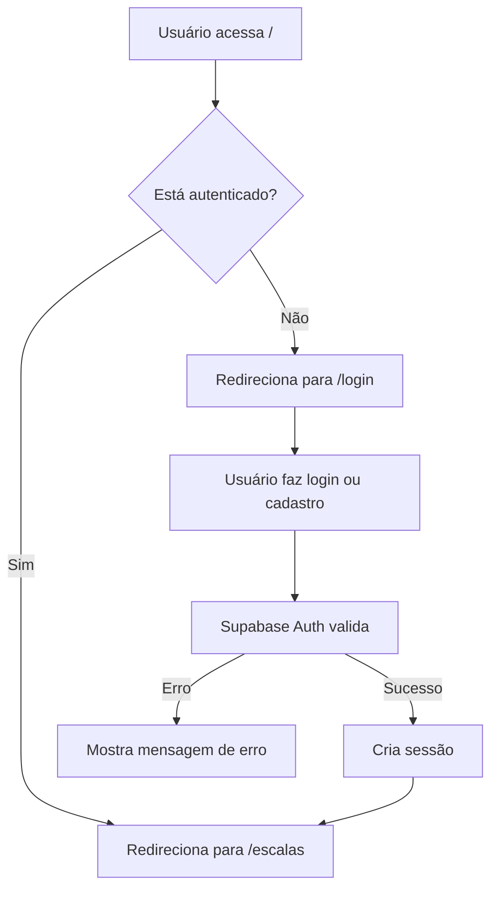

# Sistema de Autenticação - Lar Temporário

Este documento explica como funciona o sistema de autenticação implementado.

## 🔐 Fluxo de Autenticação

### 1. **Página Inicial** (`/`)
- Redireciona automaticamente para `/login`
- Usuários autenticados são redirecionados para `/escalas`

### 2. **Página de Login** (`/login`)
- Login com email e senha via Supabase Auth
- Validação de credenciais
- Feedback visual de erros
- Link para cadastro

### 3. **Página de Cadastro** (`/cadastro`)
- Registro de novos usuários
- Validação de senha (mínimo 6 caracteres)
- Confirmação de senha
- Trigger automático cria registro na tabela `usuarios`
- Redirecionamento para login após sucesso

### 4. **Proteção de Rotas**
- Middleware (`middleware.ts`) gerencia redirecionamentos
- Rotas protegidas requerem autenticação
- Rotas públicas: `/login`, `/cadastro`

## 📁 Arquivos Criados/Modificados

```
frontend/
├── app/
│   ├── page.tsx                    # ✅ Redireciona para /login
│   ├── login/page.tsx              # ✅ Login com Supabase
│   └── cadastro/page.tsx           # ✅ Registro com Supabase
├── components/
│   └── auth-provider.tsx           # ✅ Provider de autenticação (opcional)
├── middleware.ts                   # ✅ Proteção de rotas
└── lib/api/auth.ts                 # ✅ Funções de autenticação
```

## 🎯 Como Usar

### Para Testar Localmente

1. **Configure o Supabase**
   ```bash
   # Certifique-se de que o .env.local está configurado
   NEXT_PUBLIC_SUPABASE_URL=sua-url
   NEXT_PUBLIC_SUPABASE_ANON_KEY=sua-chave
   ```

2. **Execute o script SQL**
   - Execute o `supabase-schema.sql` no Supabase SQL Editor

3. **Inicie o servidor**
   ```bash
   pnpm dev
   ```

4. **Acesse o site**
   - Vá para `http://localhost:3000`
   - Você será redirecionado para `/login`

### Criar um Usuário

1. Clique em "Cadastre-se" na página de login
2. Preencha os dados:
   - Nome completo
   - Email
   - Telefone (opcional)
   - Senha (mínimo 6 caracteres)
   - Confirme a senha
3. Clique em "Cadastrar"
4. Aguarde confirmação e redirecionamento

### Fazer Login

1. Digite seu email e senha
2. Clique em "Entrar"
3. Você será redirecionado para `/escalas`

## 🔄 Fluxo Completo



## 🛡️ Segurança

- ✅ Senhas hasheadas pelo Supabase Auth
- ✅ Tokens JWT para sessões
- ✅ HTTPS obrigatório em produção
- ✅ Validação de email
- ✅ Trigger automático cria usuário na tabela
- ✅ Row Level Security (RLS) no Supabase

## 📝 Funções de Autenticação Disponíveis

```typescript
import { authApi } from '@/lib/api/auth'

// Login
await authApi.signIn(email, password)

// Cadastro
await authApi.signUp(email, password, { nome, telefone })

// Logout
await authApi.signOut()

// Verificar autenticação
const isAuth = await authApi.isAuthenticated()

// Obter usuário atual
const user = await authApi.getCurrentUser()

// Escutar mudanças
const { data } = authApi.onAuthStateChange((event, session) => {
  console.log(event, session)
})
```
## ❓ Troubleshooting

**Erro: "Email já cadastrado"**
- O email já existe no Supabase Auth
- Tente fazer login ou use outro email

**Erro: "Senha inválida"**
- Verifique se a senha tem pelo menos 6 caracteres
- Certifique-se de que as senhas coincidem

**Não consigo fazer login**
- Verifique se o `.env.local` está configurado
- Verifique se o Supabase está rodando
- Verifique se o trigger foi executado no SQL

**Redirecionamento infinito**
- Limpe o cache do navegador
- Verifique se há erros no console
- Verifique se o middleware está configurado corretamente
